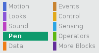
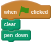
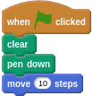
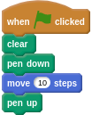

You can use the **Pen** in Scratch to draw on he **Stage**.

- With your sprite selected, click on the **Pen** menu in the Scripts Palette.

	
	
- You'll want to start by clearing the screen of any previous drawing.

	
	
- Then you can make the pen go down to start drawing

	
	
- When you move your sprite, it will draw on the **Stage**

	
	
- You can stop drawing by lifting the pen.

	
